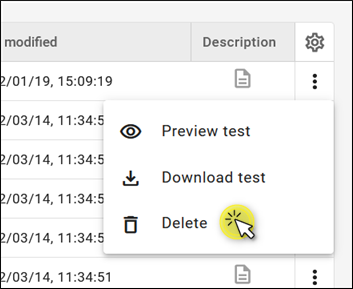

# Configure tests

## Table of contents

1. [Introduction](#introduction)
2. [Device test repository panel](#device-test-repository-panel)
3. [Listing tests](#listing-tests)
4. [Viewing test configuration](#viewing-test-configuration)
5. [Adding new tests](#adding-new-tests)
6. [Editing tests](#editing-tests)
7. [Deleting tests](#deleting-tests)
8. [Downloading tests](#downloading-tests)
9. [Previewing test](#previewing-test)

## Introduction

This documentation chapter covers the essential configuration aspects of the device tests using the **Coiote Device Management** platform.

> **Note**
> The test configuration is device-independent, which means that all the configured tests can be applied to all the devices that have registered to the platform.

## Device test repository panel

Read this section to learn about the layout and main features of the device test repository panel.

To enter the panel, select **Device test repository** and then **Server simulator** in the navigation menu.

### Panel interface

1. **Search** – use it to search the test list.
2. **Filter** - use it to filter tests either per domain or per test type (automated or semi-manual).
3. **Add test** – use it to add a test manually or import tests from a `.conf` file.
4. **Select all checkbox** – use it to select or deselect all tests visible in the list.
5. **Actions – drop-down menu** – use it to download or delete selected tests.
6. **Actions – context menu** - use it to preview, download, or delete selected tests.
7. **Test list** – features all the tests available for you at the moment, or all the tests meeting the search criteria (if entered).
8. **Test type** – shows the test type, either automated or semi-manual.
9. **Domain name** – shows the names of domains and subdomains to which your test belongs.
10. **Creation date** – shows the creation date of the test.
11. **Last modified** – shows the date when the test was last modified.
12. **Description** – shows the date of the last modification of the test (if any).

## Listing tests

Read this section to learn how to use the **search function** to list your tests.

The **Device test repository** panel displays tests in an alphabetical, searchable list for easy viewing and management. To find specific tests, use the **search function** located on top of the panel.

### Using search function

To search the list of configured tests, start typing your entry into the search field. The matching items will appear in the list.

> **Note**
> If you choose a test from the filtered list and then clear the search field, your selection will still be visible in the complete list view. Likewise, if you use the **Select all** checkbox in the full list view and then filter the list using the search, your selection will be reflected in the filtered list view.

## Viewing test configuration

Read this section to learn how to view the configuration of an individual test.

1. From the navigation menu, select **Device test repository**.
2. Find the test you want to view on the list (or using **search function**) and click its name.
3. In the action list, expand the action items by clicking the `˅` icon.

4. To expand or collapse the action list, use the **Expand all** or **Collapse all** buttons (located in the right top corner).
5. Optionally, you can use the **Edit test** button to edit your test or click the **trash bin** icon to delete it.

## Adding new tests

Read this section to learn how to add a new test. You can either add a test manually or import the test as a `.conf` file.

### Add a test manually

1. From the navigation menu, select **Device test repository**.
2. Click **Add test** and select **Add test manually**.
3. Configure your test:

    

    - Enter your **Test name** (this field is mandatory).
    - Enter your **Test description** (this field is optional).
    - Select your **Reference device** (this field is optional). You can either:
         - type the exact device ID in the **Reference device** search field and hit `Enter`,
         - click **Select reference device** and select your device from the list. If you can't see your device in the list, start typing its name in the search field to get matching results.
4. In the **Action list**, specify your actions:
    - To add your first action item, choose its name from the drop-down list, or type its name in the **Specify action** field.
    - Within the action, fill in the mandatory attributes field.
    - To add another action item, use the **Add action** button and specify your next action.
    - To change the order of actions within the test, drag and drop the action item you want to move by using the **drag** icon.
    - To copy an action item, click the **copy** icon (except for the **Loop** action).
    - To delete an action item, click the **trash bin** icon.
5. If your test is ready and all the mandatory fields are filled, click **Add a new test**.

> **Note**
> To learn more about individual test actions, see the [Test action](https://github.com/AVSystem/developer-zone/blob/master/docs/Coiote_IoT_DM/Device_tests/Test_actions.md) chapter.

### Import tests from `.conf` file

1. From the navigation menu, select **Device test repository**.
2. Click **Add test** and select **Import tests from .conf file**.
3. You'll be prompted with a dialogue box to import a `.conf` file. Add the file and click the **Import** button to proceed.

> **Note**
> To download tests into a `.conf` file, check the [Downloading tests](#downloading-tests) section.

## Editing tests

Read this section to learn how to edit a test.

> **Note**
> If you make changes to a test that has already been executed, the previous results from that test will no longer be available.

1. From the navigation menu, select **Device test repository**.
2. From the list, choose the test you want to edit and click its name.
3. Click **Edit test** in the top-right corner.
4. Edit your test:
     - Modify your **Test name** (this field is mandatory).
     - Modify your **Test description** (this field is optional).
     - Change or add your **Reference device** (this field is optional). You can either:
          - type the exact device ID in the **Reference device** search field and hit `Enter`,
          - click **Select reference device** and select your device from the list. If you can't see your device in the list, start typing its name in the search field to get matching results.
5. In the **Action list**, edit your actions:
     - Edit an existing action item by changing its name or modifying its attributes.
     - To add another action item, use the **Add action** button and specify your next action.
     - To change the order of actions within the test, drag and drop the action item you want to move by using the **drag** icon.
     - To copy an action item, click the **copy** icon (except for the **Loop** action).
     - To delete an action item, click the **trash bin** icon.
6. If you finished editing your test and all the mandatory fields are filled, click **Save changes**.

## Deleting tests

Read this section to learn how to delete tests.

1. From the navigation menu, select **Device test repository**.
2. From the **Actions** drop-down menu list, select the one or more tests you want to delete.
3. There are two ways to delete the selected tests:
    - click the **Actions** drop-down menu and select **Delete**,

    

    - click the context menu on the right and select **Delete**.

    

4. In the dialog box that appears, click **Delete**.

> **Warning**
> The test will be permanently deleted and you won't be able to recover it.

## Downloading tests

Read this section to learn how to download tests.

1. From the navigation menu, select **Device test repository**.
2. From the **Actions** drop-down menu list, select one or more tests you want to download.
3. There are two ways to download the selected tests:
    - for batch download, click the **Actions** drop-down menu and select **Download tests**,
    - for single test download, click the context menu on the right of the test entry and select **Download test**.
4. The tests are downloaded in the `.conf` format.

> **Note**
> You can edit the downloaded tests using Windows Notepad or other standard text editors.

## Previewing test

1. Select the test you want to preview.
2. Click the context menu on the right and select **Preview test**.
